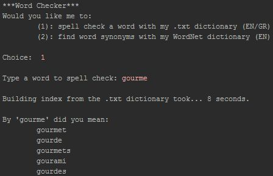
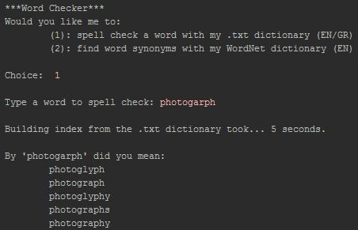

# Lucene-Spell-Checker
A Lucene 8.0.0 API based java application that, given a word from the user, scans an english dictionary and guesses the correct spell of the word

Four string distances supported:
* Jaro-Winkler (default)
* Levenshtein
* Damerau–Levenshtein (aka `LuceneLevenshteinDistance`)
* n-gram (with the default value n = 2)

It takes some time to execute the first time due to the creation of the index from the dictionary. After that, the execution time depends on your specs.

### Examples

English dictionary taken from [here](https://github.com/Coursal/crack-a-lackin/blob/master/words.english).

Essential Lucene 8.0.0 API `.jar` files included.
